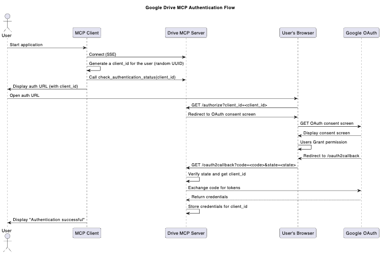

# MCP Server Google Auth Project

This project demonstrates an MCP (Model Context Protocol) server with Google Drive integration and a client to interact with it using Gemini.

## Prerequisites

- Python 3.12+
- `uv` (Python package installer and virtual environment manager)
- Google Cloud Project with Vertex AI API enabled.
- OAuth 2.0 `credentials.json` file from Google Cloud Console.

## Setup

1.  **Clone the repository:**
    ```bash
    git clone <your-repository-url>
    cd <your-repository-name>
    ```

2.  **Create and activate a virtual environment with `uv`:**
    ```bash
    uv venv
    source .venv/bin/activate  # On Windows: .venv\Scripts\activate
    ```

3.  **Install dependencies with `uv sync` from pyproject.toml:**
    ```bash
    uv sync
    ```
    The dependencies are defined in `pyproject.toml` and include:
    - `fastapi` - Web framework for the MCP server
    - `fastmcp` - MCP server implementation
    - `google-api-python-client` - Google API client
    - `google-auth` and `google-auth-oauthlib` - Google authentication
    - `google-genai` - Google Generative AI interface

4.  **Set up Google OAuth Credentials:**
    - Go to the [Google Cloud Console](https://console.cloud.google.com/)
    - Navigate to "APIs & Services" > "Credentials"
    - Create OAuth 2.0 Client IDs (Web application)
    - Add `http://localhost:8081` to "Authorized JavaScript origins"
    - Add `http://localhost:8081/oauth2callback` to "Authorized redirect URIs"
    - Download and rename the credentials file to `credentials.json` and place it in the project root

5.  **Configure Environment Variables:**
    - Create `.env` from the template:
      ```bash
      cp .env.template .env
      ```
    - Edit `.env` with your configuration:
      - `PROJECT`: Your Google Cloud Project ID
      - `LOCATION`: Your GCP region (e.g., `us-central1`)
      - `DEFAULT_MODEL`: Gemini model name (e.g., `gemini-1.5-flash-001`)
      - `HOST`: Server host (default: `localhost`)
      - `PORT`: Server port (default: `8081`)

## Running the Application

You'll need two terminals with active `uv` environments:

**1. Start the MCP Server:**
   ```bash
   python drive_web_mcp_server.py
   ```

**2. Run the Client:**
   ```bash
   python main.py
   ```
   Or specify a server URL:
   ```bash
   python main.py http://your-server-address:port
   ```

   The client will prompt you to authenticate with Google Drive:
   - Open the displayed URL in your browser
   - Complete the Google authentication flow
   - Return to the terminal and start querying Gemini with access to Google Drive

## How it Works

- **`drive_web_mcp_server.py`**: FastAPI-based MCP server that:
  - Handles OAuth 2.0 authentication with Google
  - Exposes tools for the LLM to call
  - Stores client credentials in memory by `client_id`

- **`mcp_client.py`**: Contains `MCPClient` and `GeminiMCPClient` classes:
  - Manages connections to MCP servers
  - Handles authentication flow
  - Interfaces with Gemini models
  - Translates between MCP tools and Gemini function calls

- **`main.py`**: CLI to interact with `GeminiMCPClient`

- **`.env` and `.env.template`**: Environment configuration

- **`credentials.json`**: Google OAuth 2.0 client secrets (**never commit this**)

### Authentication Flow Diagram

The following diagram illustrates the authentication process between the MCP client, MCP server and Google OAuth:



## Available Tools

- `search_drive_files(query: str)`: Search files in Google Drive
- `check_authentication_status()`: Check client authentication status